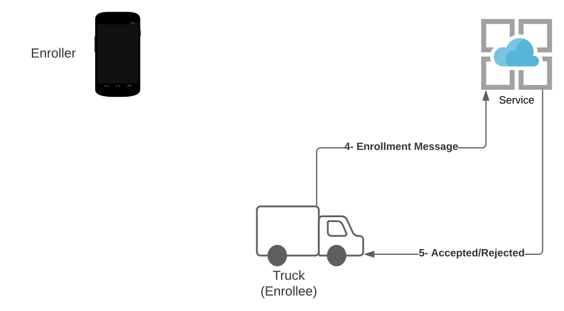

# Ockam Enrollment Service

The enrollment protocol facilitates a secure onboarding for a device to a service where the device
doesn't know about the service and vice versa. This process happens with the help of an enroller intermediary like a phone, terminal, or another device.

The three parties are the Ockam Enrollment Service (*service*) to which a device wants to connect, the *enroller* that helps onboard the device, and the device to be onboarded or enrolled called the *enrollee*.

## Background and the Problem

Enrolling IoT devices (and non-IoT devices) currently happens using non-secure and/or manual processes like:

1. Hardcoded credentials (username, password, API tokens)
2. Hardcoded service endpoints to obtain credentials with a little-to-no vetting process
3. No credentials at all. The device connects to another system that authenticates the connection to the service
1. Credential revocation or rotation is not implemented or easily performed

This results in the following problems:

1. No security when connecting externally. For example, all data (including credentials) is sent and received in plaintext versus encrypted securely.
1. Usernames, passwords, API tokens are often stored without any protection on the device––an attacker can extract these values with minimal effort with remote or physical access or downloading and reverse engineering the firmware.
1. Service endpoints can become stale. When the device turns on, it looks for an old version of the endpoint.

Ockam provides a secure enrollment protocol that solves this problem by providing a solution that is easy to use and results in secure connections between devices and an Ockam Service.

## Protocol

### Enrollee

The enrollee can be any device or application which needs to be onboarded. Enrollees will first connect to an enroller before knowing what to do next. During this initial connection, the enrollee generates a unique identifier to send to the enroller and an optional pet name. The pet name is for human readability like _"Robot Axiom"_ vs the unique identifier `"a0b1c2d3e4f5a6b7c8d9"`. 

### Enroller

The enroller is usually controlled by the same party as the enrollee, like a computer terminal or mobile device in a factory connected to a robot. For the enroller to facilitate onboarding to the service, it needs enrollment materials provided by the service. The enroller asks the service for an enrollment bundle to give to any enrollee. It may ask for more than one bundle and cache these for later use. The enrollee later receives this forwarded enrollment bundle. The enroller also forwards the enrollee's unique identifier and optional pet name to the service. This serves two purposes. First, the service will be able to recognize the enrollee when they receive a message. Second, this shows the enroller approved the enrollee to connect to the service. The service can ignore all other requests it doesn't know about. At this point, the enroller's job is done and it does not need to be involved or communicate with either the service or the enrollee for the remainder of the onboarding process.

### Service

The service receives the enrollment message from the enrollee and performs a series of checks to verify that:

1. The sender of the enrollment message is one that is expected
1. The enrollment message is valid
1. The cryptographic keys are valid

If the checks pass, the service and the enrollee can immediately begin communicating in a mutually authenticated and secure manner using the cryptographic keys established as part of the onboarding process.

## Enrollment Flow Overview

### Step 1

The enroller requests an enrollment bundle from the service, which it will later use to provide
enrollees with information about how to connect to the service.

---

### Step 2

The service puts any enrollment identifiers received from an enroller in a pending state with a possible expiration time. The service then waits for contact from the enrollee.

Once the enrollee has the enrollment bundle from the enroller, it can contact the service.

---

### Step 3

The enrollee processes the enrollment bundle to create a unique encrypted enrollment message. This message is sent to the service.

The service will accept or reject the enrollment message.

---

## Technical Details
The specific cryptographic details can be found [here](/learn/proposals/0006-enrollment/).
