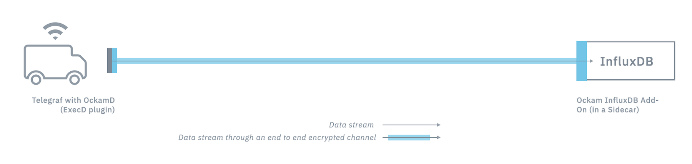

# Secure Communication Between Telegraf and InfluxDB with OckamD



Adding security to any network transaction is hard. As the `TODO`'s pile up, and your application
logic becomes more complex, the last thing you need is to manage credentials, certificates, network
code, and cryptographic keys. Leaving your critical time-series data exposed to tampering or 
disclosure to untrusted parties isn't going to fly though, so what do you do? 

Let us help! The _Ockam InfluxDB Add-on_ makes it a simple to encrypt and move your data between your 
application and InfluxDB. Here's a demo of how to use `ockamd`, our daemon process you can run next
to your application and get drop-in security in minutes.

This demo shows:
1. How Ockam InfluxDB Add-On can run as a sidecar next to your InfluxDB.
2. How OckamD can run as an
[execd output plugin](https://github.com/influxdata/telegraf/blob/release-1.16/plugins/outputs/exec/README.md)
for Telegraf inside your connected devices.
3. How these two components enable end-to-end encrypted [secure connections](/learn/concepts/secure_channels/) 
between your devices and your Influx TICK stack.

### Step 1: **Clone the Ockam repo to get the demo scripts:**
```sh
git clone https://github.com/ockam-network/ockam.git
cd ockam && git checkout tags/v0.10.0 -b main
```

> Make sure you're running the following commands from within the `ockam` directory. All commands 
below require that [Docker](https://docker.com) be installed on your machine. Using Ockam does _not_
require Docker, but it makes this demo easy to run and share!

---


### Step 2: **Run InfluxDB and ockamd**
```sh
./tools/docker/demo/influxdb.sh influxdb-ockamd
```

This launches `InfluxDB` and `ockamd` in a container, waiting for input from the "initiator" end, 
which you'll launch next. Think of that as your application, which creates the time-series data you
will store in `InfluxDB`. Note the "Responder public key" line written to your terminal. Make sure
to copy & paste this string into the `$COPIED_RESPONDER_PUBLIC_KEY` as the next command's argument. 
This is a basic way to verify that the initiator and responder are who they claim to be.

`ockamd` will receive messages over the network from the next container, decrypt them, and insert
them into InfluxDB.

---

### Step 3: **Run Telegraf and ockamd**
```sh
./tools/docker/demo/influxdb.sh telegraf-ockamd $COPIED_RESPONDER_PUBLIC_KEY
```

This launches `Telegraf` (a helpful data collection agent by InfluxData) and `ockamd` in a container
ready to capture time-series data. The "initiator" creates a 
[**secure channel**](/learn/concepts/secure_channels) with the "responder" and 
all messages sent between them are fully encrypted, end-to-end. Note that you aren't signing or 
managing certificates, or having to set up TLS anywhere in this architecture! 

_Learn more about `Telegraf` by InfluxData 
[here](https://www.influxdata.com/time-series-platform/telegraf/)._

Within the `telegraf.conf` configuration file used by `Telegraf`, you can see how it starts `ockamd`
and provides some detail about how to set up connections, validate [identity](/learn/concepts/machine-identities-and-credentials/), and more:

```toml
[agent]
    interval = "3s"
    round_interval = true
    metric_batch_size = 1000
    metric_buffer_limit = 10000
    collection_jitter = "0s"
    flush_interval = "3s"
    flush_jitter = "0s"
    precision = ""

[[outputs.execd]]
    command = ["ockamd", 
        "--role", "initiator", 
        "--route", "${OCKAMD_ROUTE}",
        "--local-socket", "${OCKAMD_LOCAL_SOCKET}",
        "--service-public-key", "${OCKAMD_RESPONDER_PUBLIC_KEY}", 
        "--service-address", "01242020"
    ] 
    restart_delay = "5s"   
    data_format = "influx"

[[inputs.http_listener_v2]]
    service_address = "0.0.0.0:8080"
    path = "/telegraf"
    methods = ["POST"]
    read_timeout = "3s"
    write_timeout = "3s"
    max_body_size = "16KB"
    data_format = "influx"
```

Specific details about `ockamd` is out of scope for this guide, but check out the 
[README](https://github.com/ockam-network/ockam/blob/develop/implementations/rust/daemon/README.md) 
on GitHub to learn more about how to use it.

---

### Step 4: **Send Telegraf input via HTTP**
```sh
./tools/docker/demo/influxdb.sh telegraf-write
```

`Telegraf` is configured to launch `ockamd` as an 
[execd output plugin](https://github.com/influxdata/telegraf/blob/release-1.16/plugins/outputs/exec/README.md), 
which conveniently extends Telegraf to capture and process time-series data for InfluxDB. `ockamd` 
creates the [**secure channel**](/learn/concepts/secure_channels/), manages the 
[**transports**](/learn/concepts/transports/), and encrypts the input from 
`Telegraf` and/or your application before it securely sends it to another `ockamd` (sitting next to 
`InfluxDB`) where it is inserted into the database after being decrypted by `ockamd`. 

_Read more about how Ockam simplifies encryption using our 
[**Vault**](/learn/concepts/vaults/) interface abstraction._ 

> Note: use a packet capture tool such as WireShark to inspect the network traffic and see that it's
fully encrypted as `ockamd` sends and receives your time-series data over the wire.

---

### Step 5: **Query data written to InfluxDB**
```sh
./tools/docker/demo/influxdb.sh influxdb-query
```

Now that there's data in `InfluxDB`, run a query using this command and see it show up via the 
`influx` client. Feel free to write more data to `Telegraf` by repeating Step 4 above and re-run 
the `influxdb-query` command to see it populated. 

---

### Step 6: **Stop & clean-up the Docker containers**
```sh
./tools/docker/demo/influxdb.sh kill-all
```
---

Thanks for checking out Ockam's InfluxDB Add-on! For more information, or to try using any of 
Ockam's fully open-source components (including Rust, Elixir, and C libraries), head to the 
[GitHub repo](https://github.com/ockam-network/ockam). Follow along by starring the repo, and send 
us a PR!

_Learn more about `InfluxDB` and how to use `ockamd` with the robust time-series database on the 
[InfluxData website](https://www.influxdata.com/), and our detailed 
[partner page](https://www.influxdata.com/partners/ockam/)._

---

Next, try a [more advanced demo](/learn/how-to-guides/using-add-ons/enterprise/influxdb/connect-and-use-ockam-hub/) 
which leverages Ockam Hub, a cloud-hosted service that makes it easy to route messages between an 
unlimited number of Ockam authenticated connections in your business.