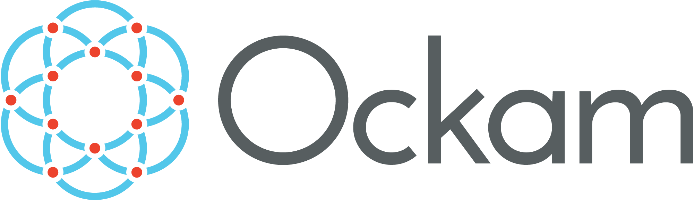

import SampleComponent from '../../components/SampleComponent.js'
import Progress from '../../components/Progress.js'
import jsonData from '../../tmp/json.js'

# Typography
---

# Heading H1

## Heading H2

### Heading H3

#### Heading H4

##### Heading H5

###### Heading H6

***Thematic Break***

> Blockqute

### Lists
- Item 1
- Item 2
- Item 3
- Item 4
- Item 5

### Links
[Internal link](samples/first-category)

[External link](http://wp.pl)

[Anchor link](#headingh2)

# Others

---

#### Line / divider

---

#### Image


#### Code

Simple inline code
`console.log('debug')`

Go lang sample
```go
package main

import (
	"fmt"
	"os"

	"github.com/ockam-network/ockam/node"
	"github.com/ockam-network/ockam/node/remote/http"
)

// This example shows how a device can connect to the Ockam Testnet.

func exitOnError(err error) {
	if err != nil {
		fmt.Fprintf(os.Stderr, "%+v\n", err)
		os.Exit(1)
	}
}
```

JSON sample
```json
{
  "userId": 1,
  "id": 1,
  "title": "delectus aut autem",
  "completed": false
}
```

### Custom components

With static data:
<Progress value='20' />

With extarnal json data:
<SampleComponent json={jsonData} title="sample" />


